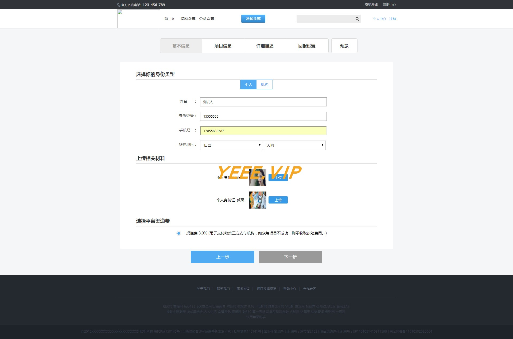

# CrowdFunding（众筹系统）

        此系统是作者本人在上学期间使用java + servlet + jsp 基础语言开发，没有使用任何现在主流框架，如ssm，maven，很适合新手学习。
    此外数据源使用了c3p0连接池，同时系统支持mysql-8，并且兼容mysql5.7

## 一、使用
1.复制git地址拉取项目然后进行构建

2.所需依赖jar包位置：/WebContent/WEB-INF/lib

3.web服务器：Tomcat，

4.创建数据库名称，运行sql文件，sql文件位置：/sql

此外项目有问题欢迎提出 ，安装运行过程中遇到问题可以联系我的 QQ ： 1324459373

## 二、项目概述

基础流程介绍（发布项目--审核--用户支持购买项目服务）

后台项目审核页面地址  ${根页面url}/admin

### 一、注册登陆后发起项目

  1.编写项目基础信息
   
   
其他步骤可以查看 doc文件夹  按照数字序号查看图片

